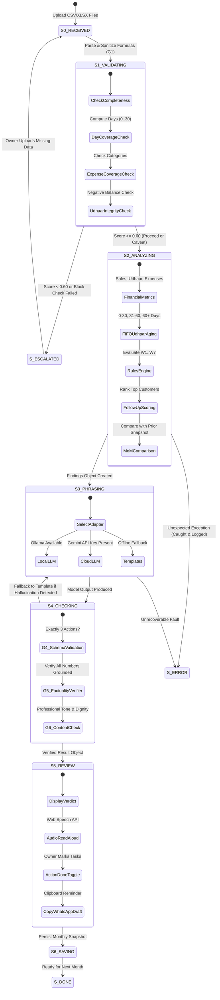

# Workflow State Machine Diagram
**Dukaan Growth Worker — 9-State Execution Lifecycle**

The workflow implements a finite state machine where transitions are idempotent, guarded by validation gates, and checkpointed to local SQLite storage.

### State Definitions & Timeout Invariants

| State | Name | Primary Responsibility | Timeout | Fallback / Escalation |
|:---|:---|:---|:---:|:---|
| **S0** | `RECEIVED` | Multipart file upload and temporary buffering | 5s | HTTP 400 Bad Request |
| **S1** | `VALIDATING` | Formula sanitization (G1) & completeness score computation | 10s | Routes to `S_ESCALATED` if score < 0.60 |
| **S2** | `ANALYZING` | Metric math, FIFO udhaar aging, W1–W7 rules, MoM comparison | 10s | Routes to `S_ERROR` if unhandled exception |
| **S3** | `PHRASING` | Converting structured findings to natural language | 15s | Auto-switches to reviewed offline templates |
| **S4** | `CHECKING` | G4 schema, G5 factuality verifier, G6 content check | 5s | Replaces text with template on any hallucination |
| **S5** | `REVIEW` | Interactive UI presentation, audio TTS, clipboard drafts | $\infty$ | User interactive state |
| **S6** | `SAVING` | Persists snapshot to `analytics.db` in WAL mode | 5s | Retries with SQLite busy handler |
| **S_DONE** | `DONE` | Successful workflow terminal state | — | Baseline available for next month |
| **S_ESCALATED** | `ESCALATED` | Safe pause state: explains data gap, asks max 2 questions | — | Owner uploads missing days |
| **S_ERROR** | `ERROR` | Unexpected fault state: no partial advice shown | — | Safe retry |
